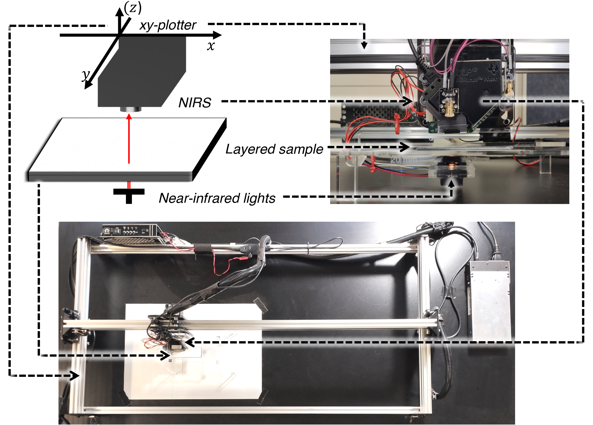
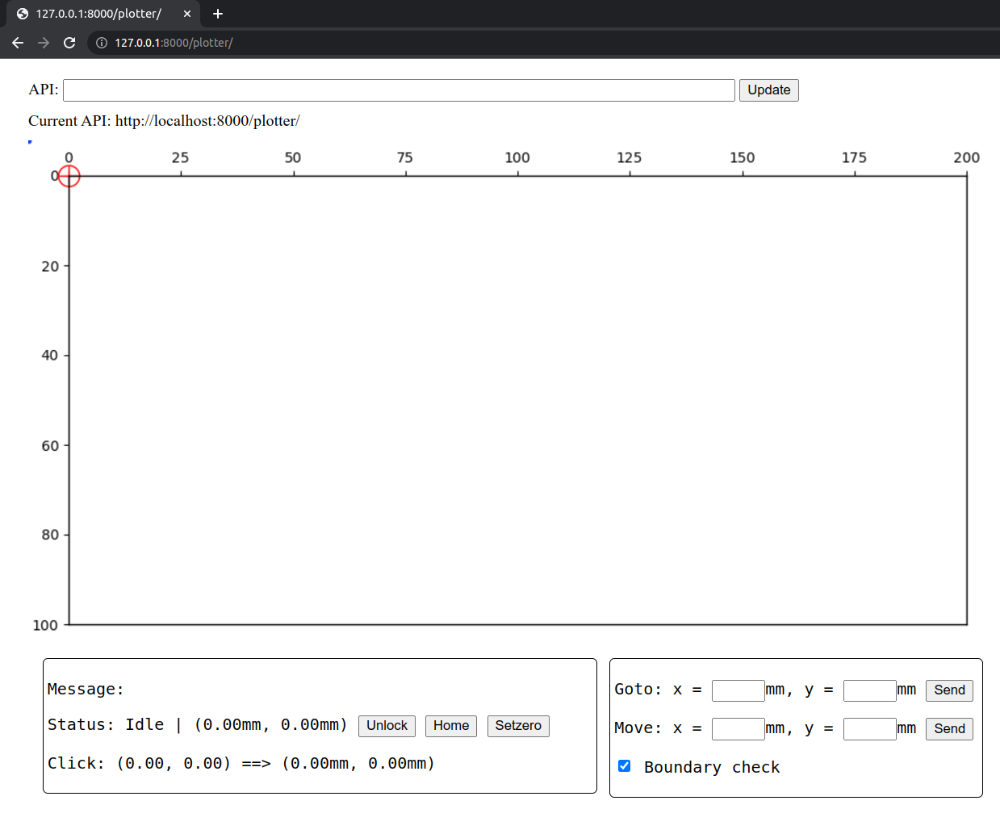

# NIRScanner-Plotter
A Python Django based server to control a NIRScan Nano and a 2D plotter. This is the code used for our paper _Near-Infrared Imaging for Information Embedding and Extraction with Layered Structures_ on ACM Transactions on Graphics.
</br>

For wavelength selection algorithm, please visit [NIRScanner-Imaging](https://github.com/HighTemplar-wjiang/NIRScanner-Imaging).
</br>

For deep-learning based text decomposition model, please visit [deep-text-decomposition](https://github.com/HighTemplar-wjiang/deep-text-decomposition).


## Hardware setup 
- DLP NIRscan Nano by TI.
- xy-plotter supporting G-code control.




## Dependencies 
- Linux OS (tested on Ubuntu 18.04 LTS).
- Python 3.6 or compatible versions.
- [NIRScanner-python](https://github.com/HighTemplar-wjiang/NIRScanner-Python) (included in this repositiory).
- Other python libraries, refer to _requirements.txt_.


## Quick start
Connect the scanner and the plotter through USB ports, then start the Django server: 

```shell
$ cd nirs_plotter_server
$ chmod +x run_server.sh
$ ./run_server.sh
```
Note **root privilege** (sudo) is required for using [NIRScanner-python](https://github.com/HighTemplar-wjiang/NIRScanner-Python).


## Usage 
### Controlling the plotter through web interface.
Use "127.0.0.0:8000/plotter/" in your local web browser to visit the web interface.



You can also visit the web page using other devices (subject to networking access control). 


### APIs 
Refer to _server_test.ipynb_. To test, run
```shell
$ jupyter lab
```
The Jupyter interface will pop up automatically, or use "127.0.0.0:8888" to visit your Jupyter lab. 
